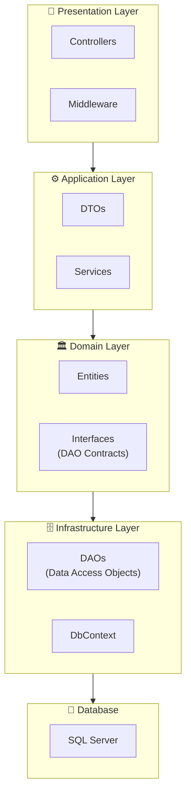
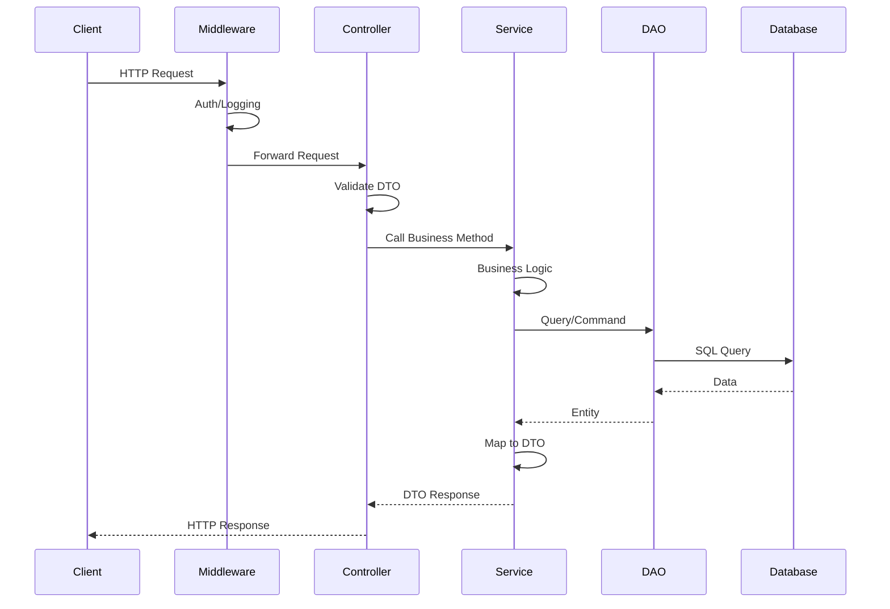

# Kiến Trúc Dự Án ASP.NET 10

## Tổng Quan

Tài liệu này mô tả kiến trúc phân tầng (Layered Architecture) phổ biến cho một dự án ASP.NET 10 API.

---

## Sơ Đồ Kiến Trúc Tổng Quan



---

## Mô Tả Trách Nhiệm Từng Tầng

### 1. 🎯 Presentation Layer (Tầng Trình Bày)

| Thành phần | Trách nhiệm |
|------------|-------------|
| **Controllers** | Nhận HTTP request, validate input cơ bản, gọi Services, trả về HTTP response với status code phù hợp |
| **Middleware** | Xử lý cross-cutting concerns: Authentication, Authorization, Logging, Exception Handling, CORS |

---

### 2. ⚙️ Application Layer (Tầng Ứng Dụng)

| Thành phần | Trách nhiệm |
|------------|-------------|
| **DTOs** | Định nghĩa cấu trúc dữ liệu trao đổi với client (Request/Response models), tách biệt với Entity |
| **Services** | Chứa **Business Logic** chính, điều phối giữa các thành phần, gọi DAO thông qua Interface |
| **Validators** | Validate business rules phức tạp (FluentValidation) |
| **Mappers** | Chuyển đổi giữa DTO ↔ Entity (AutoMapper) |

---

### 3. 🏛️ Domain Layer (Tầng Miền)

| Thành phần | Trách nhiệm |
|------------|-------------|
| **Entities** | Định nghĩa domain models/business objects, ánh xạ với database tables |
| **Interfaces** | Định nghĩa contracts cho DAO (Dependency Inversion) |
| **Enums & Constants** | Các giá trị hằng số, enum dùng trong domain |

---

### 4. 🗄️ Infrastructure Layer (Tầng Hạ Tầng)

| Thành phần | Trách nhiệm |
|------------|-------------|
| **DAOs** | Thực hiện CRUD operations, implement DAO Interfaces |
| **DbContext** | Cấu hình Entity Framework Core, quản lý database connection |
| **External Services** | Tích hợp với các dịch vụ bên ngoài (Email, Redis Cache, Third-party APIs) |

---

### 5. 💾 Database Layer

| Thành phần | Trách nhiệm |
|------------|-------------|
| **SQL Server** | Lưu trữ dữ liệu persistent |

---

## Luồng Xử Lý Request Điển Hình



---

## Cấu Trúc Thư Mục Đề Xuất

```
📦 SampleApi/
├── 📂 Controllers/          # API Controllers
├── 📂 Services/             # Business Logic
│   ├── 📂 Interfaces/       # Service contracts
│   └── 📂 Implementations/  # Service implementations
├── 📂 DAOs/                 # Data Access Objects
│   ├── 📂 Interfaces/       # DAO contracts
│   └── 📂 Implementations/  # DAO implementations
├── 📂 DTOs/                 # Request/Response models
│   ├── 📂 Requests/
│   └── 📂 Responses/
├── 📂 Entities/             # Domain models
├── 📂 Data/                 # DbContext, Configurations
├── 📂 Middleware/           # Custom middlewares
├── 📂 Validators/           # FluentValidation rules
├── 📂 Mappers/              # AutoMapper profiles
└── 📂 Migrations/           # EF Core migrations
```

---

## Nguyên Tắc Thiết Kế

Kiến trúc này tuân theo các nguyên tắc **SOLID**:

1. **Single Responsibility Principle**: Mỗi class chỉ có một trách nhiệm duy nhất
2. **Open/Closed Principle**: Mở rộng thông qua interfaces, không sửa đổi code hiện có
3. **Liskov Substitution Principle**: Các implementation có thể thay thế cho nhau
4. **Interface Segregation Principle**: Interfaces nhỏ, tập trung vào mục đích cụ thể
5. **Dependency Inversion Principle**: Các tầng trên phụ thuộc vào Interfaces, không phụ thuộc trực tiếp vào implementation cụ thể

---

## Lợi Ích Của Kiến Trúc Phân Tầng

- ✅ **Dễ bảo trì**: Code được tổ chức rõ ràng theo chức năng
- ✅ **Dễ test**: Có thể mock các dependencies thông qua interfaces
- ✅ **Tái sử dụng**: Services và DAOs có thể dùng lại ở nhiều Controllers
- ✅ **Mở rộng**: Dễ dàng thêm tính năng mới mà không ảnh hưởng code cũ
- ✅ **Team collaboration**: Các team có thể làm việc song song trên các tầng khác nhau
